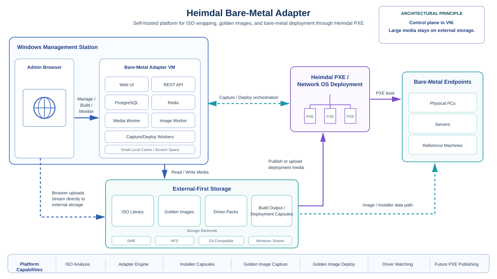

# Bare-Metal Adapter

Bare-Metal Adapter is a self-hosted management platform that adapts bootable media to Heimdal Network OS Deployment and evolves that capability into a broader bare-metal deployment framework. It is designed to wrap installer media, manage deployment artifacts, and later support golden-image capture and deployment from the same operational model.



## Project description

The project solves a practical gap in the current Heimdal PXE workflow: Heimdal boots into a WinPE environment and expects a Windows-style `setup.exe`, while many useful deployment targets are Linux installers, appliance images, or future golden-image restore workflows. Bare-Metal Adapter bridges that gap by providing a self-hosted control plane that can inspect media, select an appropriate adapter strategy, generate Heimdal-compatible deployment capsules, and keep large media on external storage instead of inside the appliance VM.

The long-term goal is not just "wrap an Ubuntu ISO", but to provide a reusable platform for:

- adapting bootable installer ISOs to Heimdal PXE workflows;
- managing deployment media in a structured library;
- capturing and deploying golden images for true bare-metal rollout;
- keeping control-plane logic in a small management appliance while using SMB/NFS/S3-backed storage for the actual media;
- supporting future driver matching, PXE publishing and deployment orchestration.

## Core principles

- **External-first storage**: large ISOs, golden images, driver packs and deployment capsules live on network-attached or mounted storage.
- **Self-hosted management station model**: the platform runs in a Linux VM hosted on a Windows management station or another local virtualization host.
- **Control plane vs. data plane separation**: metadata, jobs, API and UI stay in the appliance; bulk media stays outside it.
- **Adapter-based architecture**: different bootable media types can be supported through dedicated adapters rather than one fragile universal hack.
- **Incremental evolution**: the same platform should support ISO wrapping now and mature into golden-image and bare-metal deployment workflows later.

## Current v0.1 platform foundation

- React/TypeScript management UI
- FastAPI REST API
- PostgreSQL metadata store
- Redis platform service
- out-of-process worker
- external-first storage model
- ISO library and queued ISO analysis
- ISO9660 / El Torito / EFI / Casper / GRUB / ISOLINUX / Windows media detection
- Stage-1 WinPE bridge source carried forward under the new project name
- golden-image and installer capsule schemas
- optional conversion/PXE service profiles reserved

## Quick start

```bash
cp .env.example .env
./scripts/bootstrap.sh
# edit .env and set BAREMETAL_ADAPTER_STORAGE_HOST=/srv/baremetal-adapter/storage
docker compose up -d --build
```

Open `http://<appliance-ip>/`.

Register mounted folders on **Storage**, then queue an ISO from **Media** using its storage ID and relative path.

## Important

The web/API platform is functional foundation code. Stage-1 ISO wrapping and UEFI handoff remain laboratory functionality; golden-image capture/deploy, direct PXE publishing, driver injection and Secure Boot production hardening are deliberately scaffolded but not claimed complete.

### Browser upload behavior

`POST /api/v1/media/upload` writes incoming chunks directly to the selected registered storage location. Uploading a large ISO through the UI therefore uses the VM as the control path, not as persistent media storage.
